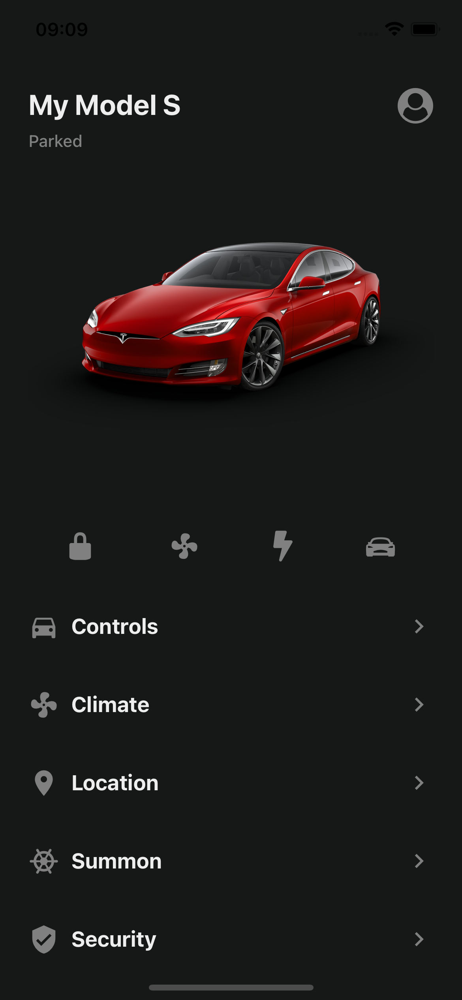
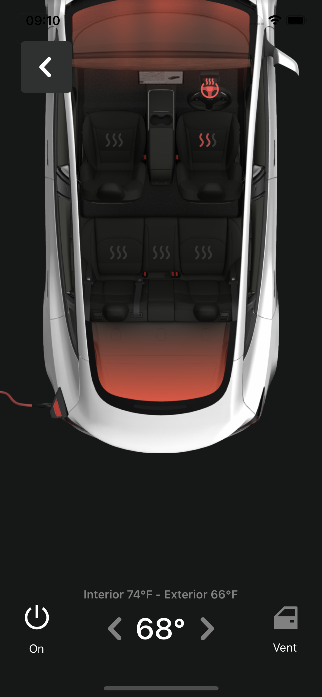

# 🚗 Tesla App

Simple mobile app built using React Native, that simulates the Tesla App interface

# ⚙️ Features

Working route for Climate.

# 💡 Acknowledgments

- How to use Expo to create a React Native app
- <View> and <Text> are similar to 
 and 
 tags in web
- Stylesheets are JS objects
- Flatlists are an useful way to render a Component passing some Props
